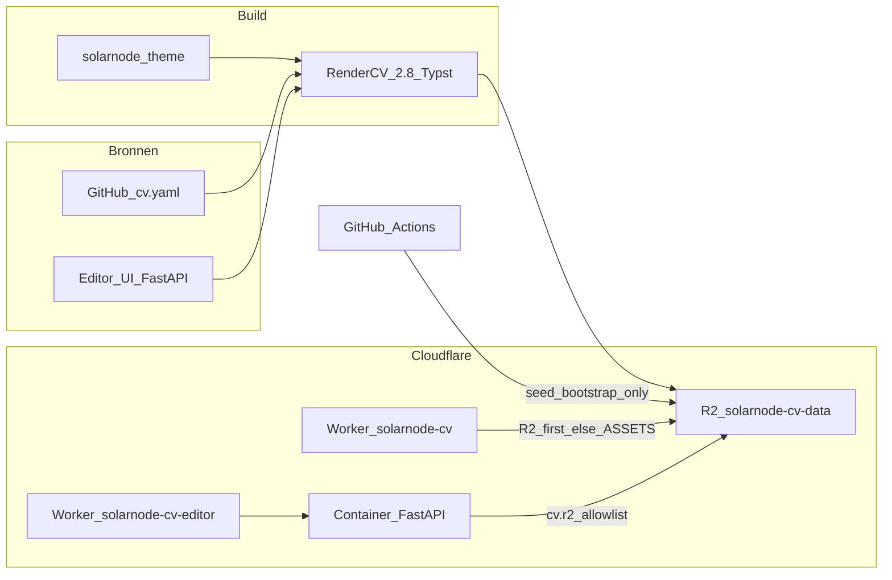

# Architectuur & roadmap — Solarnode CV

Analyse (architect + product owner) van de neergezette oplossing, plus vervolgfasen. Gebaseerd op `main` t/m hardening (PR #6) en sollicitatie-check (PR #7).

## Productdefinitie

**Wat het is:** een *developer-owned GitOps-CV-platform* voor Solarnode: één CV als `cv.yaml`, custom Typst-theme `solarnode`, lokale + CI-build, publieke site op Cloudflare, privé editor in een Container, live artifacts in R2.

**Wat het bewust niet is:** multi-user SaaS, AI-JD-matcher (Rezi), template-marketplace (Resume.io), of hosted RenderCV.com zonder eigen infra.

**Positionering:** dichtst bij RenderCV.com (zelfde engine), met Cloudflare + Git als differentiator. Ownership en engineer-workflow boven polish-UX of AI-scores.

| Opgelost | Niet in scope (tot pivot) |
| --- | --- |
| YAML→PDF reproduceerbaar (lokaal + CI) | Multi-user / team editing |
| Custom Typst-theme `solarnode` | Multi-CV / vacaturevarianten |
| Publieke site (`cv.solarnode.cc`) | JD-keyword matching |
| Privé Container-editor + R2 live | Cover letter / job tracker |
| Sollicitatie-inhoudscheck + PDF-download | Echte ATS-PDF-parse |

## Architectuur

| Laag | Component | Rol |
| --- | --- | --- |
| Content | `cv.yaml` + `solarnode/` | Enige CV-bron + design |
| Build | RenderCV via Makefile / `web/app.py` | PDF/HTML/PNG/MD |
| Local DX | FastAPI + CodeMirror | Valideren, renderen, preview |
| Publiek | `site/` Worker | R2-first artifact serving |
| Privé | `editor/` Worker + Container | Singleton editor, egress deny-by-default |
| Persistatie | R2 `solarnode-cv-data` | Live YAML + artifacts |
| CI | validate / render / deploy-* | Dry-run, build, bootstrap-seed, deploy |

**Ownership (vast):** editor is **live writer** voor runtime-publicatie; Git blijft **version-control bron**. CI seedt R2 alleen **non-destructief** (ontbrekende keys) tenzij expliciet `--force` / `R2_SEED_FORCE=1` (bootstrap of promote).

## Bevindingen → fasering

| Severity | Bevinding | Fase |
| --- | --- | --- |
| — | Analyse + roadmap vastleggen | **0** (deze docs) |
| P0 | Access niet afgedwongen / gedocumenteerd als verplicht | **1** |
| P0 | Dual writer CI ↔ editor overschrijft live R2 | **1** |
| P1 | Save publiceert stale PDF; ATS-claims te zwaar; pytest niet in CI | **1** |
| P1 | Git en R2 divergeren structureel | **2** |
| P2 | Cold start, kosten, binaries in git, dual allowlists | **3** (allowlist DRY al in 1) |
| Scope | Multi-CV / JD / echte ATS = andere productklasse | **4** (alleen bij pivot) |

Cloudflare-fasen 1–3 (publieke site → editor → R2) zijn live. Nummering hieronder is **vervolg** 0–4.

---

## Fase 0 — Analyse & roadmap

**Status:** gedaan in deze PR.

- Dit document + link vanuit README.
- Productbesluit: blijven *private RenderCV + Cloudflare publish*; geen SaaS/ATS-product tot fase 4 expliciet wordt gekozen.

---

## Fase 1 — Harden & ownership

**Status:** implementatie in deze PR.

**Doel:** veilig en consistent genoeg voor dagelijks privé-gebruik zonder data-verrassingen.

1. **Access verplicht documenteren** — checklist voor production + `workers.dev` + preview-URL’s; Access is het slot (geen app-auth in deze fase).
2. **Single-writer R2** — `seed-r2` skip bestaande keys; force alleen via `--force` / `R2_SEED_FORCE=1`.
3. **Publish-semantiek** — Opslaan schrijft YAML (lokaal + R2); alleen **Render** pusht PDF/HTML/PNG naar R2.
4. **Claims** — “sollicitatie-checklist (inhoud)”, geen ATS-engine-claim.
5. **CI quality** — pytest in validate; één allowlist-bron (`shared/r2-allowlist.json`).

**Done when:** Access-checklist in docs; CI seed overschrijft bestaande keys niet zonder force; save ≠ stale-PDF-publish; validate runt pytest; allowlist DRY.

**Niet in fase 1:** Git auto-commit, multi-CV, cold-start tuning, binaries uit git.

---

## Fase 2 — Git ↔ live convergentie

**Doel:** version control en live runtime laten samenkomen.

1. Editor-actie **Sync naar Git** (branch of draft PR met `cv.yaml`).
2. Gedocumenteerde happy path: bewerken → Render (R2 live) → Sync naar Git → merge.
3. Optionele **Promote from main** (`R2_SEED_FORCE=1`) na merge.

**Done when:** één happy path zonder stille CI-overschrijving; promote is expliciet.

---

## Fase 3 — Operatie & DX

1. Cold start / `sleepAfter` + wake-UX.
2. Editor-deploy niet rebuilden puur om `cv.yaml`-content.
3. Beleid binaries: `output/` niet (of LFS) committen.
4. Observability bij failed R2 publish; small blast-radius tokens.
5. Optimistic concurrency (etag) als fase 2 concurrentie introduceert.

---

## Fase 4 — Product-pivot (alleen op expliciet besluit)

Kies **één** pivot vóór bouw:

- **4a** Multi-CV (namespaced R2 keys + selector)
- **4b** JD-tailoring (keyword-gaps)
- **4c** Echte ATS-check (PDF-text extract)

Default tot besluit: **wont fix**.

---

## Scorecard (nu)

| Dimensie | Score | Toelichting |
| --- | --- | --- |
| Fit single-owner engineer | Hoog | Pipeline + eigen hosting |
| Sollicitatie-inhoud | Medium | Checklist + template; gebruiker vult in |
| SaaS/UX concurrentie | Laag | Bewust out of scope |
| Security (as-deployed) | Medium→Hoog* | Hardening + Access-checklist (*Access blijft operationeel) |
| Data-consistentie Git↔R2 | Medium* | Non-destructive seed + save≠artifact publish |
| CI quality | Medium→Hoog* | pytest in validate |

\* na afronden fase 1.
